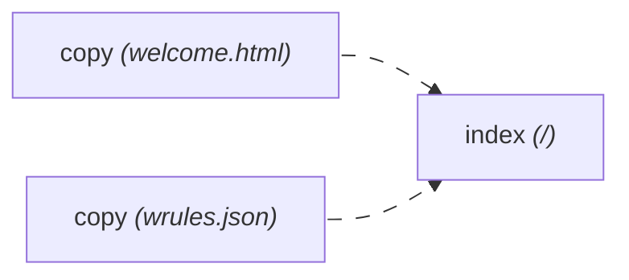

# Getting Started

## Create a Project

You should have [NodeJS](https://nodejs.org/en) installed on your system.

1. Create a Webpan project using the setup wizard.
   ```sh
   $ npm create webpan@latest
   ```
2. Start Webpan in live preview mode in the project folder
   ```sh
   $ npm run watch
   ```
3. In a separate terminal, start an HTTP server
   ```sh
   $ npx live-server build/dist
   ```

This opens a browser window showing the current state of the project.

## Rules and Processors

- Each _processor_ takes one file from `src/` and outputs any number of
  files to `build/dist/`
- _Rules_ orchestrate processors to generate the site you want, such as this page.

### Example

`src/wrules.json` is a _rules_ file.

```json
{
  "processors": {
    "**/": "index",
    "**": "copy"
  }
}
```

- `index` and `copy` are _processors_.
  > Each processor is an npm package, to install e.g. `index`, run
  >
  > ```sh
  > $ npm install wp-index
  > ```
- The _rules_ specifies which files to apply the processors to.

| Processor | Applied to  | Purpose                                              |
| --------- | ----------- | ---------------------------------------------------- |
| index     | All folders | Generates `index.html`, listing all generated files. |
| copy      | All files   | Outputs a copy of the file to `build/dist/`          |

### Processor Ordering

A processor does not declare which files it will output before running, so
`index` needs to wait for all `copy` processors to complete before it can know which
files are in `build/dist/`.

Giving us a dependency graph of



Webpan will figure this out on its own based on `wrules.json`.

> #### Have a Guess
>
> How do you think the dependency graph of this docs site looks like?
>
> ```mermaid
> ---
> config:
>   themeVariables:
>     treeView:
>       labelColor: '#AAAAAA'
>       lineColor: '#AAAAAA'
>       iconColor: '#AAAAAA'
>       descriptionColor: '#AAAAAA'
> ---
> treeView-beta
>     "book.yml"
>     "wrules.json"
>     "introduction/"
>         "toc.yml"
>         "what-is-webpan.md"
>         "quick-start.md (You are here)"
> ```
>
> ##### wrules.json
> ```json
> {
>   "processors": {
>     "/": [
>         "vitepress-resources", // output CSS for docs
>         "dir-toc"              // compute table of content
>     ],
>     "**/*.yml": "yaml-parse",  // parse .yml files
>     "**.md": {
>       "vitepress-doc": {},     // generate the final HTML file
>       "unified": {             // convert markdown to HTML
>         "stack": [
>           "remark-parse",
>           "remark-math",
>           "remark-gfm",
>           "remark-frontmatter"
>           "remark-rehype",
>           "rehype-external-links",
>           "rehype-katex",
>           "rehype-mermaid",
>           "rehype-starry-night",
>           "rehype-stringify"
>         ]
>       }
>     }
>   }
> }
> ```
>
> <details>
> <summary>Click to reveal</summary>
>
> ```mermaid
> ---
> config:
> htmlLabels: false
> ---
> flowchart LR
> gettingstarted["unified <i>(getting-started.md)</i>"]
> whatiswebpan["unified <i>(what-is-webpan.md)</i>"]
> dirtoc["dir-toc <i>(/)</i>"]
> doc-1["vitepress-doc <i>(getting-started.md)</i> <b style="color: red">You are here</b>"]
> doc-2["vitepress-doc <i>(what-is-webpan.md)</i>"]
> resources["vitepress-resources <i>(/)</i>"]
> toc["yaml-parse <i>(toc.yml)</i>"]
> book["yaml-parse <i>(book.yml)</i>"]
>
> linkStyle default stroke-dasharray:12,4,stroke-dashoffset:900,animation:dash 15s linear infinite
> whatiswebpan --> dirtoc
> toc --> dirtoc
> gettingstarted --> doc-1
> whatiswebpan --> doc-2
> gettingstarted --> dirtoc
> dirtoc --> doc-1
> dirtoc --> doc-2
> resources --> doc-1
> resources --> doc-2
> book --> doc-1
> book --> doc-2
> ```
>
> </details>

## What's next?
- Join the [Webpan Matrix room](https://matrix.to/#/#webpan:siri.ws), since
  Webpan is under active development, I need a way to notify you about bugfixes
  and breaking changes.
- To create a docs site with Webpan, proceed to the [Vitepress-like Docs Guide](../use-case-guides/vitepress-like-docs.md).
    > Note: it is not actually Vitepress, it just looks like it.
- To create your own processor, read the [Processor Dev Guide]().
